# 🏗️ SPOTS Architecture Diagrams

## System Architecture Overview

```mermaid
graph TB
    subgraph "Data Sources"
        IG[Instagram]
        FB[Facebook]
        RD[Reddit]
        OSM[OpenStreetMap]
        IGN[IGN Services]
    end
    
    subgraph "Data Collection Layer"
        PS[Playwright Scraper]
        AS[API Scrapers]
        GC[Geocoding Service]
    end
    
    subgraph "Backend Services"
        FA[FastAPI Application]
        DB[(SQLite Database)]
        DS[Data Services]
        ES[Enrichment Services]
    end
    
    subgraph "Frontend Application"
        LM[Leaflet Maps]
        RM[Regional Map]
        PM[Premium Map]
        API[API Service]
    end
    
    subgraph "External APIs"
        OM[Open-Meteo]
        GP[Géoplateforme]
        BAN[Base Adresse Nationale]
    end
    
    %% Data flow
    IG --> PS
    FB --> PS
    RD --> AS
    OSM --> AS
    
    PS --> DS
    AS --> DS
    DS --> DB
    
    DB --> FA
    ES --> FA
    
    FA --> API
    API --> LM
    API --> RM
    API --> PM
    
    IGN --> GP
    GP --> ES
    BAN --> GC
    GC --> ES
    OM --> FA
```

## Data Flow Diagram

## Database Schema

## Component Architecture

## IGN Services Integration

```mermaid
graph TD
    subgraph "IGN Géoplateforme"
        WMTS[WMTS Service]
        WMS[WMS Service]
        WFS[WFS Service]
        ELEV[Elevation API]
        GEO[Geocoding API]
        ISO[Isochrone API]
    end
    
    subgraph "SPOTS Integration"
        TL[Tile Layers]
        FE[Feature Extraction]
        EE[Elevation Enrichment]
        AC[Address Conversion]
        RA[Reachability Analysis]
    end
    
    WMTS --> TL
    WMS --> TL
    WFS --> FE
    ELEV --> EE
    GEO --> AC
    ISO --> RA
    
    TL --> |Map Display| Frontend
    FE --> |Nearby Features| Backend
    EE --> |Spot Enrichment| Backend
    AC --> |Geocoding| Backend
    RA --> |Accessibility| Backend
```

## Deployment Architecture

## API Request Flow

## State Management Flow

## Performance Optimization Strategy

---

These diagrams provide a visual understanding of the SPOTS architecture, making it easier to understand the system's components and their interactions. They can be rendered in any Markdown viewer that supports Mermaid syntax.
