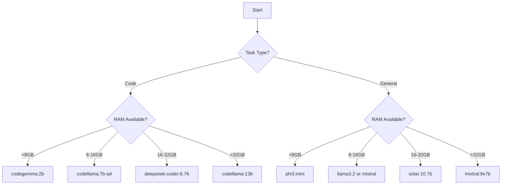

# 🚀 Ollama Model Selection Framework

## 📋 Table of Contents
1. [Model Categories](#model-categories)
2. [Hardware Requirements](#hardware-requirements)
3. [Task-to-Model Mapping](#task-to-model-mapping)
4. [Model Selection Decision Tree](#model-selection-decision-tree)
5. [Testing & Benchmarking](#testing--benchmarking)
6. [Practical Implementation](#practical-implementation)
7. [Troubleshooting Guide](#troubleshooting-guide)

## 🎯 Model Categories

### 1. Code-Specific Models
Best for: Code analysis, generation, debugging

| Model | Size | Memory | Strengths | Weaknesses |
|-------|------|--------|-----------|------------|
| **deepseek-coder** | 1.3B-33B | 1-20GB | Excellent code understanding | Large sizes need GPU |
| **codellama** | 7B-34B | 4-20GB | Meta's code model, good for many languages | Memory hungry |
| **starcoder2** | 3B-15B | 2-10GB | Fast, good for completion | Less instruction following |
| **codegemma** | 2B-7B | 1.5-5GB | Google's efficient code model | Smaller context window |

### 2. General Purpose Models
Best for: Q&A, reasoning, text generation

| Model | Size | Memory | Strengths | Weaknesses |
|-------|------|--------|-----------|------------|
| **llama3.2** | 1B-3B | 1-2GB | Latest, very efficient | Smaller than Llama 2 |
| **mistral** | 7B | 4-5GB | Excellent balance | Single size option |
| **qwen2.5** | 0.5B-72B | 0.5-40GB | Chinese+English, coding capable | Larger versions need GPU |
| **gemma2** | 2B-27B | 1.5-16GB | Google's model, good reasoning | Can be verbose |

### 3. Specialized Models
Best for: Specific use cases

| Model | Size | Memory | Use Case |
|-------|------|--------|----------|
| **granite3** | 2B-8B | 1.5-6GB | Enterprise, IBM model |
| **phi3** | 3.8B-14B | 2-8GB | Reasoning, Microsoft |
| **solar** | 10.7B | 6-8GB | Long context (32K) |
| **sqlcoder** | 7B-15B | 4-10GB | SQL generation |

### 4. Small & Fast Models
Best for: Quick responses, limited hardware

| Model | Size | Memory | Speed |
|-------|------|--------|-------|
| **tinyllama** | 1.1B | <1GB | Very fast |
| **phi3:mini** | 3.8B | 2GB | Good reasoning |
| **gemma:2b** | 2B | 1.5GB | Balanced |
| **qwen2.5:0.5b** | 0.5B | 0.5GB | Tiny but capable |

## 💻 Hardware Requirements

### Memory Formula
```
Required RAM = Model Size × Quantization Factor + Overhead

Quantization Factors:
- Q8_0: 1.0x (full quality)
- Q6_K: 0.75x
- Q5_K_M: 0.625x
- Q4_K_M: 0.5x (recommended)
- Q3_K_M: 0.375x (lower quality)

Overhead: ~1-2GB for system
```

### Hardware Tiers

#### Tier 1: Limited (8GB RAM)
- **Recommended**: tinyllama, phi3:mini, gemma:2b
- **Quantization**: Q3_K_M or Q4_K_M for 7B models
- **Avoid**: Models over 7B

#### Tier 2: Standard (16GB RAM)
- **Recommended**: mistral, llama3.2, codellama:7b
- **Quantization**: Q4_K_M or Q5_K_M
- **Can run**: Most 7B-13B models

#### Tier 3: Power User (32GB+ RAM)
- **Recommended**: deepseek-coder:33b, solar, mixtral
- **Quantization**: Q5_K_M or higher
- **Can run**: Most models except 70B+

#### Tier 4: GPU-Enabled
- **NVIDIA GPU**: Use -gpu variants
- **Mac M1/M2/M3**: Metal acceleration automatic
- **Can run**: Large models with appropriate VRAM

## 🎯 Task-to-Model Mapping

### 🚀 Hybrid Approach: Rapid + Deep

For optimal performance, use a two-tier system:

1. **Rapid Insight Models** (< 3GB, < 2s response)
   - First pass for quick answers
   - Simple questions, definitions, quick fixes
   - Immediate feedback while deep model loads

2. **Deep Analysis Models** (Use available RAM)
   - Complex reasoning, architecture design
   - Security analysis, comprehensive reviews
   - Detailed explanations

### Code Tasks
```yaml
Code Review/Analysis:
  rapid: codegemma:2b        # Quick syntax/style check
  deep: deepseek-coder:6.7b  # Full vulnerability analysis
  fallback: codellama:7b

SQL Generation:
  rapid: granite3:8b         # Simple queries
  deep: sqlcoder:15b         # Complex joins/optimization
  fallback: deepseek-coder

Bug Fixing:
  rapid: starcoder2:3b       # Obvious bugs
  deep: codellama:13b-instruct # Complex logic errors
  fallback: deepseek-coder:6.7b

Code Completion:
  rapid: codegemma:2b        # Fast autocomplete
  deep: starcoder2:15b       # Context-aware completion
  fallback: codellama:7b-code
```

### General Tasks
```yaml
Q&A/Chat:
  rapid: phi3:mini           # Facts, definitions
  deep: llama3.2:latest      # Explanations, reasoning
  fallback: mistral:7b

Summarization:
  rapid: tinyllama           # Quick summary
  deep: mistral:7b-instruct  # Detailed summary
  fallback: solar:10.7b

Analysis/Reasoning:
  rapid: phi3:medium         # Initial thoughts
  deep: qwen2.5:14b          # Complex analysis
  fallback: gemma2:9b

Creative Writing:
  rapid: llama3.2:3b         # Ideas, outlines
  deep: mixtral:8x7b         # Full content
  fallback: solar:10.7b
```

### 🎯 When to Use Each Tier

**Rapid Only (Skip Deep):**
- Simple calculations
- Definitions and facts
- Yes/no questions
- Quick code fixes
- Time-sensitive responses

**Both Tiers (Rapid → Deep):**
- Architecture design
- Security analysis
- Complex debugging
- Learning/tutorials
- Multi-step reasoning

**Deep Only (Skip Rapid):**
- When you know it's complex
- Long-form content generation
- Detailed code review
- Critical analysis

## 🌳 Model Selection Decision Tree



## 🧪 Testing & Benchmarking

### Quick Test Script
```python
#!/usr/bin/env python3
"""ollama_model_test.py - Test model performance"""

import time
import psutil
import requests
import json

def test_model(model_name, prompt, max_tokens=100):
    """Test a model and return metrics"""
    
    # Get initial memory
    initial_mem = psutil.virtual_memory().used / 1024**3
    
    # Start timing
    start_time = time.time()
    
    # Make request
    response = requests.post(
        "http://localhost:11434/api/generate",
        json={
            "model": model_name,
            "prompt": prompt,
            "options": {"num_predict": max_tokens},
            "stream": False
        },
        timeout=60
    )
    
    end_time = time.time()
    final_mem = psutil.virtual_memory().used / 1024**3
    
    if response.status_code == 200:
        result = response.json()
        tokens = len(result.get('response', '').split())
        
        return {
            "model": model_name,
            "success": True,
            "time": end_time - start_time,
            "tokens": tokens,
            "tokens_per_sec": tokens / (end_time - start_time),
            "memory_used": final_mem - initial_mem,
            "response": result.get('response', '')[:200]
        }
    else:
        return {
            "model": model_name,
            "success": False,
            "error": response.status_code
        }

# Test multiple models
models_to_test = [
    "tinyllama",
    "phi3:mini", 
    "gemma:2b",
    "llama3.2:latest",
    "mistral:7b",
    "codellama:7b"
]

prompt = "Write a Python function to find prime numbers"

results = []
for model in models_to_test:
    print(f"Testing {model}...")
    result = test_model(model, prompt)
    results.append(result)
    if result['success']:
        print(f"✓ {model}: {result['tokens_per_sec']:.1f} tok/s, {result['memory_used']:.1f}GB")
    else:
        print(f"✗ {model}: Failed with {result['error']}")

# Save results
with open('model_benchmark_results.json', 'w') as f:
    json.dump(results, f, indent=2)
```

### Benchmark Metrics
1. **Speed**: Tokens per second
2. **Memory**: Peak RAM usage
3. **Quality**: Task-specific accuracy
4. **Reliability**: Success rate
5. **Context**: Maximum context length

## 🛠️ Practical Implementation

### 1. Model Manager Class
```python
class OllamaModelManager:
    def __init__(self):
        self.available_ram = psutil.virtual_memory().total / 1024**3
        self.installed_models = self.get_installed_models()
        self.model_configs = self.load_model_configs()
    
    def recommend_model(self, task_type, quality_preference="balanced"):
        """Recommend best model for task and hardware"""
        
        suitable_models = self.filter_by_ram(
            self.get_models_for_task(task_type)
        )
        
        if quality_preference == "fast":
            return suitable_models[0]  # Smallest
        elif quality_preference == "best":
            return suitable_models[-1]  # Largest that fits
        else:
            return suitable_models[len(suitable_models)//2]  # Middle
    
    def auto_fallback(self, models, prompt):
        """Try models in order until one works"""
        for model in models:
            try:
                return self.run_inference(model, prompt)
            except Exception as e:
                print(f"Model {model} failed: {e}")
                continue
        raise Exception("All models failed")
```

### 2. CLI Tool
```bash
#!/bin/bash
# ollama-select.sh - Smart model selector

case "$1" in
    "code")
        if [ $(free -g | awk '/^Mem:/{print $2}') -lt 8 ]; then
            MODEL="codegemma:2b"
        elif [ $(free -g | awk '/^Mem:/{print $2}') -lt 16 ]; then
            MODEL="codellama:7b-q4"
        else
            MODEL="deepseek-coder:6.7b"
        fi
        ;;
    "chat")
        if [ $(free -g | awk '/^Mem:/{print $2}') -lt 8 ]; then
            MODEL="phi3:mini"
        else
            MODEL="llama3.2:latest"
        fi
        ;;
    *)
        echo "Usage: $0 [code|chat|sql|summarize]"
        exit 1
        ;;
esac

echo "Selected model: $MODEL"
ollama run $MODEL
```

### 3. Auto-Pull Script
```python
def ensure_model(model_name):
    """Pull model if not available"""
    
    # Check if model exists
    response = requests.get("http://localhost:11434/api/tags")
    models = [m['name'] for m in response.json()['models']]
    
    if model_name not in models:
        print(f"Pulling {model_name}...")
        subprocess.run(["ollama", "pull", model_name])
    
    return model_name in models
```

## 🔧 Troubleshooting Guide

### Common Issues

#### 1. Out of Memory (OOM)
```bash
Error: model requires more system memory (X GiB) than is available (Y GiB)
```
**Solutions**:
- Use quantized version: `ollama pull codellama:7b-q4_0`
- Try smaller model: `codellama:7b` → `codegemma:2b`
- Free up RAM: Close other applications
- Use CPU-only: Remove `-gpu` suffix

#### 2. Timeout Errors
```python
Error: Read timeout
```
**Solutions**:
- Increase timeout: `timeout=120`
- Use smaller context: Reduce prompt size
- Try faster model: Use `tinyllama` for testing

#### 3. Poor Quality Output
**Solutions**:
- Use instruct variant: `mistral:7b-instruct`
- Adjust temperature: Lower = more focused
- Try specialized model: Use task-specific model
- Increase quantization: Q4 → Q5 or Q6

#### 4. Slow Performance
**Solutions**:
- Enable GPU: Use `-gpu` variants on NVIDIA
- Reduce context: Smaller prompts
- Use smaller model: Trade quality for speed
- Check background processes: `htop` or Task Manager

### Performance Optimization

#### 1. Model Loading
```bash
# Keep model loaded in memory
ollama serve

# Pre-load frequently used models
ollama run mistral:7b /exit
ollama run codellama:7b /exit
```

#### 2. Batch Processing
```python
# Process multiple prompts efficiently
def batch_process(model, prompts):
    # Keep model loaded
    session = requests.Session()
    results = []
    
    for prompt in prompts:
        response = session.post(
            "http://localhost:11434/api/generate",
            json={"model": model, "prompt": prompt, "keep_alive": "5m"}
        )
        results.append(response.json())
    
    return results
```

## 📊 Model Comparison Matrix

| Task | Best Model | Good Model | Fast Model | Tiny Model |
|------|------------|------------|------------|------------|
| **Python Code** | deepseek-coder:6.7b | codellama:7b | starcoder2:3b | codegemma:2b |
| **SQL Queries** | sqlcoder:15b | deepseek-coder | granite3:8b | codellama:7b-q3 |
| **JavaScript** | codellama:13b | deepseek-coder | codellama:7b | tinyllama |
| **Code Review** | mixtral:8x7b | solar:10.7b | mistral:7b | phi3:mini |
| **Bug Fixing** | codellama:13b-instruct | deepseek-coder:6.7b | codellama:7b | gemma:2b |
| **Documentation** | mixtral:8x7b | mistral:7b-instruct | llama3.2 | tinyllama |
| **Q&A** | llama3.2:latest | mistral:7b | phi3:medium | phi3:mini |
| **Summarization** | solar:10.7b | mistral:7b | gemma2:9b | tinyllama |

## 🚀 Quick Start Commands

```bash
# Install Ollama
curl -fsSL https://ollama.ai/install.sh | sh

# Pull recommended starter models
ollama pull llama3.2:latest  # General purpose
ollama pull codellama:7b-q4_K_M  # Code
ollama pull phi3:mini  # Small & fast

# Test your setup
echo "What is 2+2?" | ollama run phi3:mini

# Check available models
ollama list

# Remove unused model
ollama rm model-name

# Update model
ollama pull model-name
```

## 📚 Additional Resources

- [Ollama Model Library](https://ollama.ai/library)
- [Model Quantization Guide](https://github.com/ggerganov/llama.cpp/wiki/Quantization)
- [Hardware Requirements Calculator](https://github.com/ollama/ollama/blob/main/docs/faq.md)
- [Community Model Benchmarks](https://github.com/ollama/ollama/discussions)

---

Remember: Start small, test thoroughly, and scale up based on your actual needs and hardware!